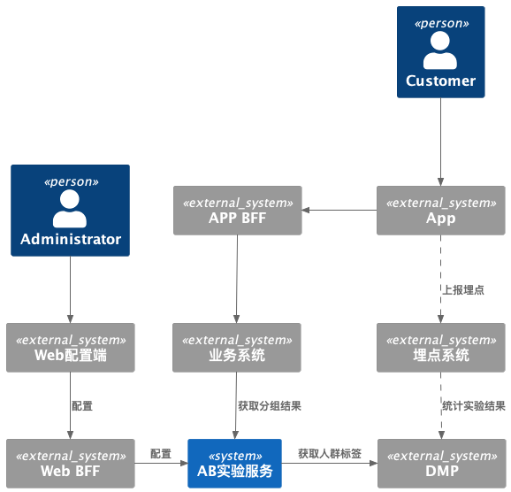
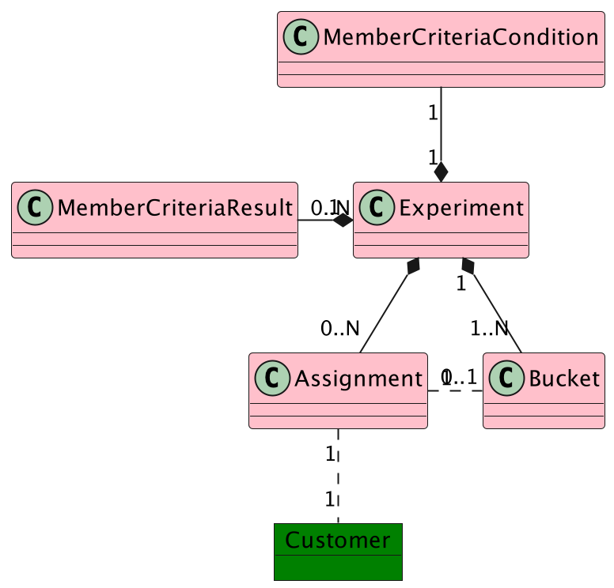
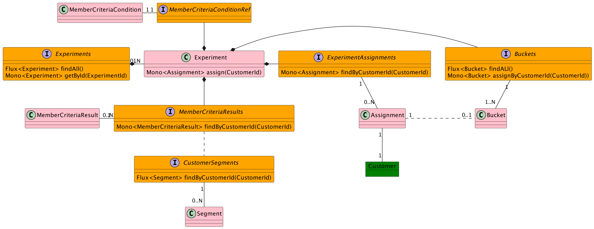

# AB测试服务及基于Smart Domain的领域模型设计与实现

周末看到徐昊老师在极客时间上的[《如何使用Smart Domain实现DDD》](https://www.bilibili.com/video/BV1QT411J7jh?mid=349471258&p=1&share_from=ugc&share_medium=iphone&share_plat=ios&share_session_id=AE38A38A-25FE-4018-86D7-3D8056587454&share_source=WEIXIN&share_tag=s_i&timestamp=1657888503&unique_k=y9oo1MR)的分享，真正体会到了什么是领域模型驱动开发， 模型和实现相一致。 随即按照Smart Domain的方法，用项目上在做的AB测试服务进行了练习，对领域模型和实现进行了重构。特此记录一下自己的一些理解。

# Smart Domain
## 实践DDD中常见问题
徐昊老师在分享中指出，实践DDD中常见的一个问题是假设了同样的全局边界中的实体（aggregation root 和 entity）具有相同的生命周期（同时加载到内存或同时从内存中消失），而由于数据库和服务间远程调用存在，实体间的生命周期不都是同步的。为了在领域模型中屏蔽这种不同步，我们需要引入Service / Repository 等技术组件来帮助我们跨越生命周期完成一定的业务一致性逻辑，从而使得原本应该在领域概念中的业务逻辑外溢到到技术组件中，使得领域模型趋于贫血化。

## 理想的面向对象模型
有一组彼此互联并与领域概念相对应的对象模型。
有适当的抽象：
* 生命周期和实现细节被封装起来
* 持久化逻辑也是实现细节应该封装起来
## 什么是Smart Domain Pattern
* 一个纯面向对象的方法，不引入Service
* 模型被建模成一个对象连接的对象图
* 模型图可被直接映射成Restful API
* 领域层充当一个屏蔽实现细节的抽象层
* 实现概念模型、实现模型和API一致映射

## 以数据抽象行为
面向对象的一个重要设计思想是，以数据抽象行为。对象/数据是行为产生的结果，数据可以表示某个行为。

实体（Entity）由身份（Identity）、值（Value）和与其他对象的关联关系（Association）构成， 其中比较关键的是身份和关联关系。

实体可以很容易的映射成松散表示模型，Identity映射为URI， Value映射为内容， Association映射为链接。

关联关系可以作为一种抽象机制

关联关系是对生命周期抽象 -  不需要间接获取的内容为同生命周期，需要间接调用获取的内容为不同生命周期

关联关系是对行为的抽象 - 数据是行为产生的结果，通过关联关系获取的对象结果表征某一行为

模型中显示的将关联关系建模为抽象对象，则可以屏蔽对象之间的生命周期差异，并将合理的行为分配给关联关系对象进行封装。

### 默认间接异步获取
考虑到对象可能是通过数据库或远程调用加载，所以关联关系中方法获取数据应默认是间接且异步获取的，从而能很好屏蔽不同生命周期差异。这点让我想到了响应式类库Reactor中的[Mono和Flux](https://dimitr.im/difference-between-mono-and-flux)。

Mono和Flux是响应式开源库Reactor中两个基本的集合对象，Mono会返回0到1个对象，Flux则可返回多个对象。

利用Mono和Flux可以用异步非阻塞的流式访问和处理数据，个人觉得这点与关联关系中法获取数据应默认是间接且异步十分契合。

## Smart Domain建模步骤
1. 基于对象为行为的结果寻找实体
2. 寻找实体间的关联关系
3. 将关联关系显示建模为抽象对象
4. 为对象（包括关联关系）分配职责

## Smart Domain实现步骤
1. 依据领域模型将关联关系实现为接口
2. 将实体实现为类分配身份和关联关系接口
3. 为关联关系接口提供具体实现
4. 将领域模型映射为Restful API

## 分层架构
Smart Domain Pattern中仅分为两个大层和一个亚层：

领域层 - 定义实体和实体间关联关系抽象接口

集成层 - 提供关联关系接口实验

API层 - 向外暴露基于领域层对象关系图得到的Restful API

# AB测试服务
客户近期在对APP进行改版，为了给运营提供改版前后业务数据对比，需要通过AB测试收集数据。由于已有商用解决方案和开源软件存在与需求不完全匹配和已有系统集成问题，项目上最终决定结合已有的埋点和数据处理能力基础上开发一个AB测试服务。
## 上下文介绍

> AB实验服务管理AB实验生命周期  
> DMP根据用户属性或行为为用户添加标签，实验圈定相似属性的人群来进行实验统计，增加实验可信度  
> AB实验服务根据用户标签判断用户是否进入实验  
> 进入实验的用户随机分配实验组，并记录其分组结果，保证实验过程中用户分组结果固定  
> 实验过程中，业务系统通过AB实验获取用户分组结果，根据分组生效不同配置  
> APP根据后端不同配置加载展示不同内容，通过埋点上报事件  
> DMP结合埋点和业务数据，分析实验结果

## 通过Smart Domain对AB实验服务建模
1. 根据行为结果寻找实体

   Experiment  （实验）- 作为聚合根聚合实验相关逻辑

   Bucket（分组）-  每个实验包含多个实验分组

   MemberCriteriaCondition（人群圈定条件）-  用户进入实验判定条件

   MemberCriteriaResult （人群圈定结果）- 依据人群圈定条件得到的人群圈定结果

   Assignment（分组结果）-  每个用户会在每个实验中会有一个分组结果

2. 寻找实体间的关联关系

   得到如下模型图

3. 将关联关系建模为抽象对象
4. 为对象（包括关联关系）分配职责

   AB实验中处理对象加载和保存的职责外比较重要的一个职责是为用户计算分组，分组主要逻辑是判断用户是否满足圈人条件，满足圈人条件则实验分组中随机分配一个。

   按照[GRASP](https://en.wikipedia.org/wiki/GRASP_)中信息专家模式，职责应该分配给拥有实现职责所需要的所有信息的对象。计算分组需要依赖圈人条件、圈人结果、实验分组，同时拥有这三个信息的对象是Experiment，所以该职责分配给Experiment （assign方法）。 其中随机分配到某个分组进需要实验分组的信息，该职责可以委托给关联关系对象Buckts（assignByCustomerId方法）。

至此我们得到如下最终的AB实验领域模型：

## 实现

得到了上面的领域模型，实现过程相对比较简单，按照上文中Smart Domain实现步骤进行即可，部分实现代码已上传到GitHub上（[GitHub - pc-dong/ab-testing](https://github.com/pc-dong/ab-testing)）。

# 总结
Smart Domain Pattern 将关联关系显式建模为抽象对象，对象关联数据访问默认认为是间接异步的，统一了因为数据库访问或远程调用带来的生命周期差异；可以将职责合理的分配给对象（包括关联关系）而不会引入Service等额外技术组件；分层简单真正实现模型、实现相一致。
个人能力有限，有理解不到位的地方，还望大家批评指正！

