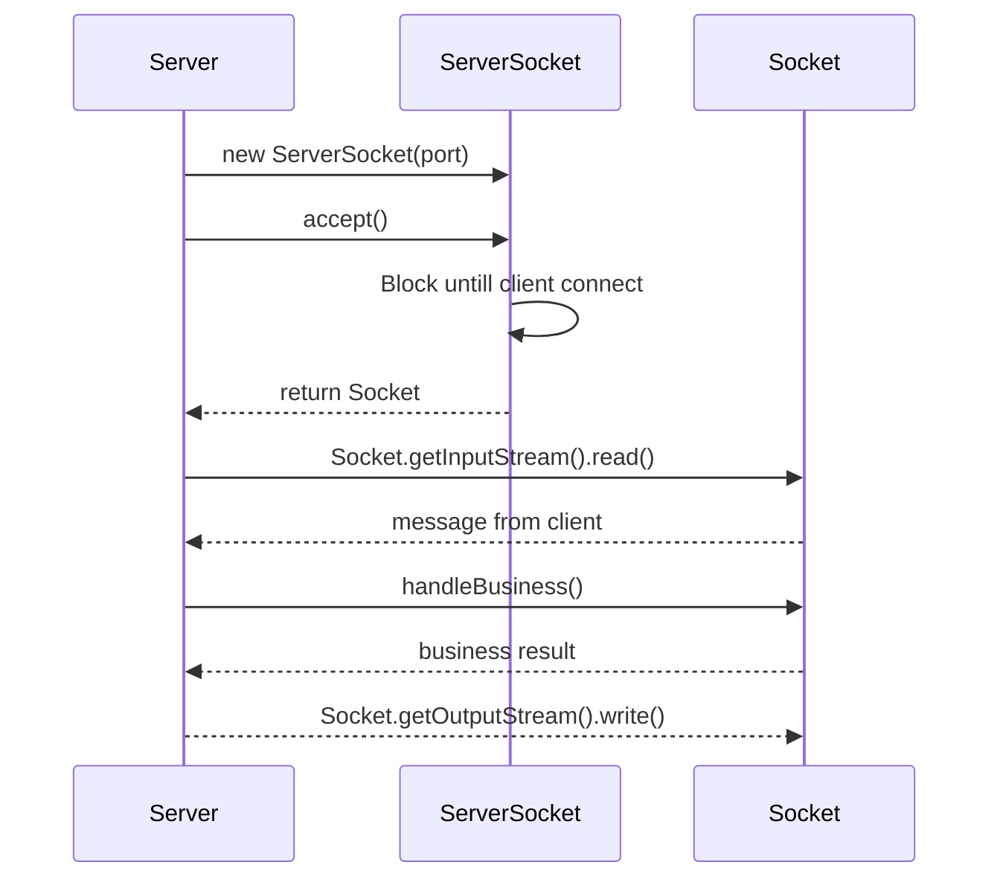
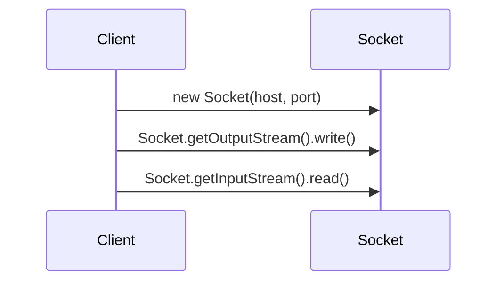

# Java Socket编程01 - 阻塞IO

>本系列文章式响应式学习之旅的网络篇系列文章，响应式一大特性是异步非阻塞，网络通信方面更是如此，本系列文章将从最基本的网络编程开始，逐步探索异步非组塞网络框架底层基本概念原理和应用。

说起网络编程，不得不提两个基本概念：网络IO和[Socket](https://en.wikipedia.org/wiki/Network_socket)。网络IO是指计算机通过网络进行数据交换的过程，而Socket则是网络IO的基本工具，是网络通信的基本单元。网络IO可以分为两种：阻塞IO和非阻塞IO。本篇文章将从阻塞IO开始，介绍Java中的阻塞IO，及对应的Socket编程特点。


## 阻塞IO 

阻塞IO是指当用户线程发起IO请求后，内核会将用户线程阻塞，直到IO操作完成后才会唤醒用户线程。

## Socket

Socket对应七层网络模型中的传输层，是网络通信的基本单元，通过Socket可以实现网络通信的建立、数据传输、连接关闭等操作。我们都知道传输层的协议有两种：TCP和UDP。

## Java中的阻塞IO

Java中的阻塞IO相关工具类库在`java.net`包下，TCP对应最常用的工具类是`Socket`和`ServerSocket`, UDP对应的工具类是`DatagramSocket`和`DatagramPacket`。

### UDP

UDP是无连接的，无需建立连接，直接发送数据包，不保证可靠送达，直接应用的场景较少，但也因为其通信协议简单，可基于业务场景需求自定义应用层的通信协议，比如Http3的基础协议[QUIC](https://en.wikipedia.org/wiki/QUIC#:~:text=QUIC%20(%2Fkw%C9%AAk,described%20at%20an%20IETF%20meeting.)就是基于UDP协议定制的传输层网络协议相较于TCP提高了面向连接的网络应用的性能。

因为UDP是无连接的，因此UDP的Socket编程相对简单，以下是一个简单的UDP Socket通信示例：

* 接收方

```java
@Slf4j
public class Receiver {
    private final int port;
    private boolean running = false;
    
    public Receiver(int port) {
        this.port = port;
    }

    public void start() {
        running = true;
        try (DatagramSocket datagramSocket = new DatagramSocket(port)) {
            while (running) {
                byte[] buffer = new byte[1024];

                DatagramPacket packet = new DatagramPacket(buffer, buffer.length);
                datagramSocket.receive(packet);
                log.info("received: {}", new String(buffer, 0, packet.getLength()));
            }
        } catch (IOException e) {
            log.error("error", e);
        }
    }
    
    public void stop() {
        this.running = false;
    }

    public static void main(String[] args) {
        Receiver server = new Receiver(5454);
        server.start();
    }
}
```

* 发送方

```java
@Slf4j
public class Sender {
    public static void main(String[] args) {
        try (java.net.DatagramSocket socket = new java.net.DatagramSocket()) {
            byte[] buffer = "hello server".getBytes();
            java.net.DatagramPacket packet = new java.net.DatagramPacket(buffer, buffer.length, java.net.InetAddress.getByName("localhost"), 5454);
            socket.send(packet);
        } catch (java.io.IOException e) {
            log.error("error", e);
        }
    }
}
```

UPD的Socket编程相对简单，不是我们本篇文章的重点，因此不再深入讨论。

## TCP

TCP是面向连接的，需要建立连接，保证数据可靠送达，应用场景较广，比如Http1.1和Http2的基础协议都是基于TCP协议的。

因为TCP是面向连接的，因此相较于UPD，TCP的Socket编程相对复杂，首先我们从最基本的示例开始：

* 服务端

```java
@Slf4j
public class Server {
    private final int port;

    public Server(int port) {
        this.port = port;
    }

    public void start() {
        try (ServerSocket serverSocket = new ServerSocket(port)) {
            log.info("server started");
            try (Socket clientSocket = serverSocket.accept()) {
                log.info("client connected");
                try (PrintWriter out = new PrintWriter(clientSocket.getOutputStream(), true);
                     BufferedReader in = new BufferedReader(new InputStreamReader(clientSocket.getInputStream()))) {
                    String greeting = in.readLine();
                    if ("hello server".equals(greeting)) {
                        out.println("hello client");
                    } else {
                        out.println("unrecognised greeting");
                    }
                }
            }
        } catch (java.io.IOException e) {
            log.error("error", e);
        }
    }
}
```
通过ServerSocket监听指定端口，ServerSocket.accept()方法会阻塞当前线程直到有客户端连接，然后通过客户端对应Socket获取输入输出流进行数据交换。

* 客户端

```java
public class Client {
    public String sendMessage(String message, String host, int port) {
        try (Socket socket = new Socket(host, port);
             PrintWriter out = new PrintWriter(socket.getOutputStream(), true);
             BufferedReader in = new BufferedReader(new InputStreamReader(socket.getInputStream()))) {
            out.println(message);
            return in.readLine();
        } catch (java.io.IOException e) {
            throw new RuntimeException(e);
        }
    }
}
```
客户端通过Socket连接服务端，获取输入输出流与服务端进行数据交换。

* 测试

```java
@Test
void start() {
   int port = 6666;
   Server server = new Server(port);
   new Thread(server::start).start();

   Client client = new Client();
   String result = client.sendMessage("hello server", "localhost", port);
   Assertions.assertEquals("hello client", result);
}
```

这个示例中，基本实现了客户端和服务端的简单通信，客户端发送"hello server"，服务端返回"hello client"。

处理过程可以用如下时序图表示：

- 服务端


- 客户端




> 但是这个示例中有一个问题，**服务端处理一次客户端请求后便会退出，无法处理多个请求**。

我们可以对服务端进行如下简单改造，使其能够处理多个客户端请求：

```java
@Slf4j
public class Server {
    private final int port;
    private boolean running = false;

    public Server(int port) {
        this.port = port;
    }

    public void start() {
        running = true;
        try (ServerSocket serverSocket = new ServerSocket(port)) {
            log.info("server started");
            while (running) {
                handle(serverSocket);
            }
        } catch (java.io.IOException e) {
            log.error("error", e);
        }
    }

    private static void handle(ServerSocket serverSocket) throws IOException {
        try (Socket clientSocket = serverSocket.accept()) {
            log.info("client connected");
            try (PrintWriter out = new PrintWriter(clientSocket.getOutputStream(), true);
                 BufferedReader in = new BufferedReader(new InputStreamReader(clientSocket.getInputStream()))) {
                String greeting = in.readLine();
                if ("hello server".equals(greeting)) {
                    out.println("hello client");
                } else {
                    out.println("unrecognised greeting");
                }
            }
        }
    }

    public void stop() {
        this.running = false;
    }
}
```

对应测试代码：

```java
@Test
void start() {
    int port = 6666;
    Server server = new Server(port);
    new Thread(server::start).start();

    Client client = new Client();
    String result = client.sendMessage("hello server", "localhost", port);
    Assertions.assertEquals("hello client", result);

    String result2 = client.sendMessage("hello server", "localhost", port);
    Assertions.assertEquals("hello client", result2);

    server.stop();
}
```
> 改进后的服务端可以处理多个客户端请求。但是服务端链接建立和数据读写在同一个线程，服务端只有处理完一个请求后才能接收新的链接，换言之**服务端无法处理并发请求**。

为了实现处理并发请求的能力，可以将**数据读写的处理放在独立的线程处理**，为每一个客户端创建一个线程，收到操作系统资源限制不太现实，因此我们需要用到线程池。改进后的服务端代码如下所示：

```java
@Slf4j
public class Server {
    private final int port;
    private boolean running = false;

    private final static ExecutorService threadPool = Executors.newFixedThreadPool(Runtime.getRuntime().availableProcessors() * 2 + 1);

    public Server(int port) {
        this.port = port;
    }

    public void start() {
        running = true;
        try (ServerSocket serverSocket = new ServerSocket(port)) {
            log.info("server started");
            while (running) {
                Socket clientSocket = serverSocket.accept();
                threadPool.submit(() -> new ClientHandler(clientSocket).handle());
            }
        } catch (IOException e) {
            log.error("error", e);
        }
    }

    public void stop() {
        this.running = false;
    }
}


@Slf4j
public class ClientHandler {
    private final Socket clientSocket;

    public ClientHandler(Socket clientSocket) {
        this.clientSocket = clientSocket;
    }
    public void handle() {
        try (PrintWriter out = new PrintWriter(clientSocket.getOutputStream(), true);
             BufferedReader in = new BufferedReader(new InputStreamReader(clientSocket.getInputStream()))) {
            String greeting = in.readLine();

            String response = handleBusiness(greeting);

            out.println(response);
        } catch (IOException e) {
            log.error("error", e);
        }
    }

    private static String handleBusiness(String greeting) {
        if ("hello server".equals(greeting)) {
            return "hello client";
        } else {
            return  "unrecognised greeting";
        }
    }
}
```

如果业务处理耗时较长，我们可以将业务处理放在独立的线程池中处理，提升网络数据读写的效率。

> 经过以上改进，服务端可以处理多个客户端请求，并且可以处理并发请求。但是由于ServerSocket.accept()方法是阻塞式的，一次只能接收一个客户端连接。如果并发访问的客户端过多，这会成为单台服务器处理的性能瓶颈。要解决这个问题，我们需要使用多路复用技术，即NIO。

## 总结

本篇文章介绍了Java中的阻塞IO和Socket编程，通过简单的示例介绍了服务端和客户端的基本通信过程，以及如何处理多个客户端请求和并发请求。但是阻塞IO的缺点是显而易见的，无法处理并发请求，性能瓶颈明显。下一篇文章将介绍Java中的NIO，以及如何使用NIO解决阻塞IO的性能瓶颈问题。