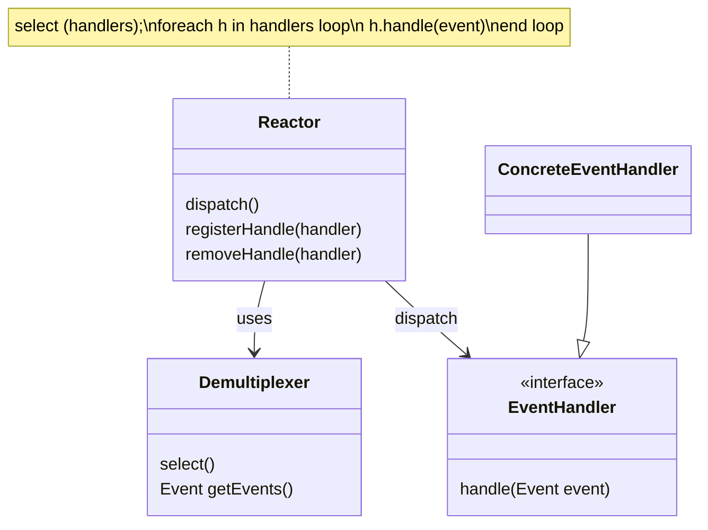
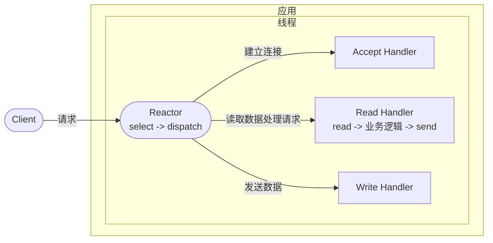
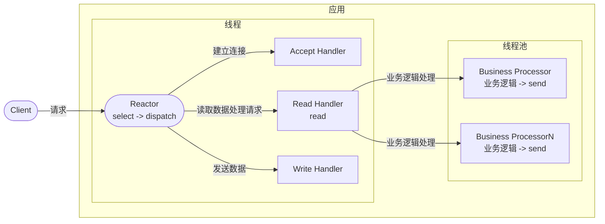
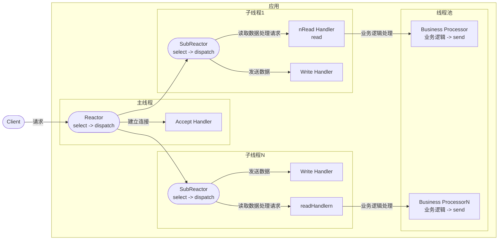

# Java Socket编程03 - Reactor模式

> IO多路复用技术可以大大提高应用网络通信的处理效率，但直接使用需要关注底层网络API的细节。[Reactor模式](http://www.dre.vanderbilt.edu/~schmidt/PDF/reactor-siemens.pdf)是一种基于事件驱动的设计模式，基于面向对象的思想对IO多路复用进行了封装，可以有效分离关注点。常见的开源软件比如 Redis、Nginx、Netty都采用了设计模式，Node.js的Event Loop机制也于借鉴了Reactor模式。

## Reactor模式

Reactor模式是一种基于事件驱动的设计模式，由Doug Schmidt在1995年提出，是一种处理并发IO的设计模式。Reactor模式的核心思想是将IO多路复用的底层细节封装起来，提供高层的抽象接口，使得应用可以专注于业务逻辑，而不用关心底层网络API的细节。

Reactor模式的核心组件有四个：Reactor、Demultiplexer、Event和EventHandler。Reactor基于Demultiplexer监听IO事件，当有IO事件发生时，Reactor会将事件分发给对应的Handler进行处理。EventHandler是具体的业务逻辑处理单元，负责处理IO事件。Demultiplexer是IO多路复用的核心组件，负责监听IO事件，当有IO事件发生时，通知Reactor，Java中可由Selector实现。Event是事件及相关数据载体，Java中对应SelectionKey。



以下是Java中Reactor模式的简单实现：
```java
@Slf4j
public class Reactor {

    @Getter
    private final Selector demultiplexer;
    
    private boolean running = false;

    private final Map<Integer, EventHandler> registeredHandlers = new ConcurrentHashMap<>();

    public Reactor() throws IOException {
        this.demultiplexer = Selector.open();
    }

    public void registerHandler(int eventType, EventHandler handler) {
        registeredHandlers.put(eventType, handler);
    }
    
    public void RemoveHandler(int eventType) {
        registeredHandlers.remove(eventType);
    }
    
    public void registerChannel(int eventType, SelectableChannel channel) throws ClosedChannelException {
        channel.register(demultiplexer, eventType);
    }

    public void dispatch() {
        running = true;
        while (running) {
            try {
                demultiplexer.select();
                var selectedKeys = demultiplexer.selectedKeys().iterator();
                while (selectedKeys.hasNext()) {
                    var key = selectedKeys.next();
                    selectedKeys.remove();
                    var handler = registeredHandlers.get(key.interestOps());
                    if (handler != null) {
                        handler.handle(key);
                    }
                }
            } catch (IOException e) {
                log.error("Error occurred in Reactor: {}", e.getMessage());
            }
        }
    }
    
    public void stop() {
        running = false;
        try {
            this.demultiplexer.close();
        } catch (IOException e) {
            throw new RuntimeException(e);
        }
    }
}
```

```java
public interface EventHandler {
    void handle(SelectionKey key);
}
```

Reactor模式最核心的两个组间是Reactor和EventHandler，它俩负责的事情如下：

Reactor 负责监听和分发事件，事件类型包含连接事件、读写事件；
EventHandler 负责处理事件，如 read -> 业务逻辑 -> send；

其中Reactor和Handler可以在同一个线程中，也可以在不同的线程中，Reactor的数量也可以是一个或多个。这样可以组合出多种不同的Reactor模式实现，最常见的是如下三种：

* 单 Reactor 单线程；
* 单 Reactor 多线程；
* 多 Reactor 多进程；

下面我们分别通过一个例子来实现这三种Reactor模式。

## 单Reactor单线程

以下是单Reactor单线程示意图：


以下是单Reactor单线程的实现的例子：

```java
@Slf4j
public class AcceptHandler implements EventHandler {

    @Override
    public void handle(SelectionKey key) {
        log.info("AcceptHandler: accept a connection");
        try {
            ServerSocketChannel serverSocketChannel = (ServerSocketChannel) key.channel();
            SocketChannel socketChannel = serverSocketChannel.accept();
            socketChannel.configureBlocking(false);
            socketChannel.register(key.selector(), OP_READ);
        } catch (Exception e) {
            log.error("Error occurred in AcceptHandler: ", e);
        }
    }
}

@Slf4j
public class ReadHandler implements EventHandler {

    @Override
    public void handle(SelectionKey key) {
        ByteBuffer buffer = ByteBuffer.allocate(1024);
        SocketChannel socketChannel = (SocketChannel) key.channel();
        Selector demultiplexer = key.selector();
        try {
            StringBuilder content = new StringBuilder();
            buffer.clear();
            while (socketChannel.read(buffer) > 0) {
                buffer.flip();
                content.append(new String(buffer.array()).trim());
                buffer.clear();
            }

            log.info("ReadHandler: {}", content);
            businessLogic(content.toString(), socketChannel, demultiplexer);
        } catch (Exception e) {
            key.cancel();
            try {
                socketChannel.close();
            } catch (Exception ex) {
                log.error("Error occurred in ReadHandler: ", ex);
            }
        }
    }

    private void businessLogic(String message, SocketChannel socketChannel,Selector demultiplexer) throws ClosedChannelException {
        if("hello server".equals(message)) {
            write("hello client", socketChannel, demultiplexer);
        } else {
            write("unrecognized message", socketChannel, demultiplexer);
        }
    }

    private void write(String message, SocketChannel socketChannel, Selector demultiplexer) throws ClosedChannelException {
        socketChannel.register(demultiplexer, SelectionKey.OP_WRITE, message);
        demultiplexer.wakeup();
    }
}


@Slf4j
public class WriteHandler implements EventHandler {
    @Override
    public void handle(SelectionKey key) {
        SocketChannel socketChannel = (SocketChannel) key.channel();
        String message = (String) key.attachment();
        log.info("WriteHandler: " + message);
        try {
            if (null != message && !message.isEmpty() && socketChannel.isOpen() && socketChannel.isConnected()) {
                socketChannel.write(wrap(message.getBytes()));
            }
            socketChannel.close();
        } catch (Exception e) {
            log.error("Error occurred in WriteHandler:", e);
        }
    }
}

@Slf4j
public class Server {

    private final int port;
    private Reactor reactor;
    private ServerSocketChannel serverSocketChannel;

    public Server(int port) {
        this.port = port;
    }

    public void start() {
        new Thread(() -> {
            try {
                serverSocketChannel = ServerSocketChannel.open();
                Selector selector = Selector.open();
                serverSocketChannel.bind(new InetSocketAddress("localhost", port));
                serverSocketChannel.configureBlocking(false);
                reactor = new Reactor(selector);
                reactor.registerHandler(SelectionKey.OP_ACCEPT, new AcceptHandler());
                reactor.registerHandler(SelectionKey.OP_READ, new ReadHandler());
                reactor.registerHandler(SelectionKey.OP_WRITE, new WriteHandler());

                reactor.registerChannel(SelectionKey.OP_ACCEPT, serverSocketChannel);
                reactor.dispatch();
            } catch (IOException e) {
                log.error("error", e);
            }

        }).start();
    }

    public void stop() {
        reactor.stop();

        try {
            serverSocketChannel.close();
        } catch (IOException e) {
            log.error("error", e);
        }
    }

    public static void main(String[] args) {
        Server server = new Server(8080);
        server.start();
    }
}


public class Client {
    public String sendMessage(String message, String host, int port) {
        ByteBuffer buffer = ByteBuffer.allocate(1024);

        try (SocketChannel client = SocketChannel.open(new InetSocketAddress(host, port))) {
            client.write(ByteBuffer.wrap(message.getBytes()));
            client.read(buffer);
            buffer.flip();
            return new String(buffer.array()).trim();
        } catch (java.io.IOException e) {
            throw new RuntimeException(e);
        }
    }
}


class ServerTest {
    @Test
    void start() throws IOException {
        int port = 6666;
        Server server = new Server(port);
        server.start();

        Client client = new Client();
        String result = client.sendMessage("hello server", "localhost", port);
        Assertions.assertEquals("hello client", result);

        String result1 = client.sendMessage("hello server", "localhost", port);
        Assertions.assertEquals("hello client", result1);

        server.stop();
    }
}
```

该模式中，Reactor的监听和分发事件，连接、读写、业务处理均在同一个线程中完成。这种模式适用于业务逻辑简单，处理速度快的场景。如果业务逻辑复杂，处理速度慢，会影响其他事件的处理。

## 单Reactor多线程

以下是单Reactor多线程示意图：


单Reactor多线程模式中将业务逻辑处理单元放入线程池中处理，可以大大减少业务逻辑处理时间对网络IO操作的影响。

对于单Reactor多线程的实现我们仅需对上文中的ReadHandler进行改造，在业务逻辑处理的地方增加线程池即可, 改造后的代码如下所示：

```java
@Slf4j
public class ReadHandler implements EventHandler {

    private static final ExecutorService threadPool = Executors.newFixedThreadPool(Runtime.getRuntime().availableProcessors() * 2 + 1);
    @Override
    public void handle(SelectionKey key) {
        ByteBuffer buffer = ByteBuffer.allocate(1024);
        SocketChannel socketChannel = (SocketChannel) key.channel();
        Selector demultiplexer = key.selector();
        try {
            StringBuilder content = new StringBuilder();
            buffer.clear();
            while (socketChannel.read(buffer) > 0) {
                buffer.flip();
                content.append(new String(buffer.array()).trim());
                buffer.clear();
            }

            log.info("ReadHandler: {}", content);
            threadPool.execute(() -> {
                try {
                    businessLogic(content.toString(), socketChannel, demultiplexer);
                } catch (ClosedChannelException e) {
                    throw new RuntimeException(e);
                }
            });
        } catch (Exception e) {
            key.cancel();
            try {
                socketChannel.close();
            } catch (Exception ex) {
                log.error("Error occurred in ReadHandler: ", ex);
            }
        }
    }

    private void businessLogic(String message, SocketChannel socketChannel,Selector demultiplexer) throws ClosedChannelException {
        if("hello server".equals(message)) {
            write("hello client", socketChannel, demultiplexer);
        } else {
            write("unrecognized message", socketChannel, demultiplexer);
        }
    }

    private void write(String message, SocketChannel socketChannel, Selector demultiplexer) throws ClosedChannelException {
        socketChannel.register(demultiplexer, SelectionKey.OP_WRITE, message);
        demultiplexer.wakeup();
    }
}
```

「单 Reactor」的模式还有个问题，因为一个 Reactor 对象承担所有事件的监听和响应，而且只在主线程中运行，在面对瞬间高并发的场景时，容易成为性能的瓶颈的地方。


## 多Reactor多线程

要解决「单 Reactor」的问题, 需要引入「多 Reactor」的模式，形成多Reactor多线程的模式。以下是多Reactor多线程示意图：



简单来说这个方案是将一个Reactor对象拆分成一个主Reactor和多个子Reactor，主Reactor负责监听连接事件，子Reactor负责监听读写事件。主Reactor在接收到连接事件后，将连接分配给某个子Reactor进行后续的数据读写处理。

以下是多Reactor多线程的实现的例子, 我们只需要在单Reactor多线程模式的实现基础上对AcceptHandler如下改造：

```java
@Slf4j
public class AcceptHandler implements EventHandler {


    private final List<Reactor> reactors;
    private int index;

    public AcceptHandler() throws IOException {
        this(4);
    }

    public AcceptHandler(int subReactorCount) throws IOException {
        reactors = new ArrayList<>();
        ExecutorService threadPool = Executors.newFixedThreadPool(subReactorCount);
        for(int i = 0; i < subReactorCount; i++) {
            Reactor reactor = new Reactor();
            reactor.registerHandler(OP_READ, new ReadHandler());
            reactor.registerHandler(SelectionKey.OP_WRITE, new WriteHandler());
            reactors.add(reactor);
            threadPool.execute(reactor::dispatch);
        }
    }

    @Override
    public void handle(SelectionKey key) {
        log.info("AcceptHandler: accept a connection");
        try {
            ServerSocketChannel serverSocketChannel = (ServerSocketChannel) key.channel();
            SocketChannel socketChannel = serverSocketChannel.accept();
            socketChannel.configureBlocking(false);
            reactors.get(index++ % reactors.size()).registerChannel(OP_READ, socketChannel);
        } catch (Exception e) {
            log.error("Error occurred in AcceptHandler: ", e);
        }
    }
}
```

我们新增一个列表存放多个Reactor对象，每个Reactor分配一个子线程执行事件监听，然后在AcceptHandler中将连接事件中，将连接通过轮询注册给某个子Reactor进行后续的数据读写处理。


## 总结

Reactor模式是一种基于事件驱动的设计模式，它将IO多路复用的底层细节封装起来，提供高层的抽象接口，使得应用可以专注于业务逻辑，而不用关心底层网络API的细节。Reactor模式的核心组件有四个：Reactor、Demultiplexer、Event和EventHandler。Reactor负责监听和分发事件，事件类型包含连接事件、读写事件；EventHandler负责处理事件，如 read -> 业务逻辑 -> send。Reactor模式的实现有多种，最常见的是单Reactor单线程、单Reactor多线程、多Reactor多线程。