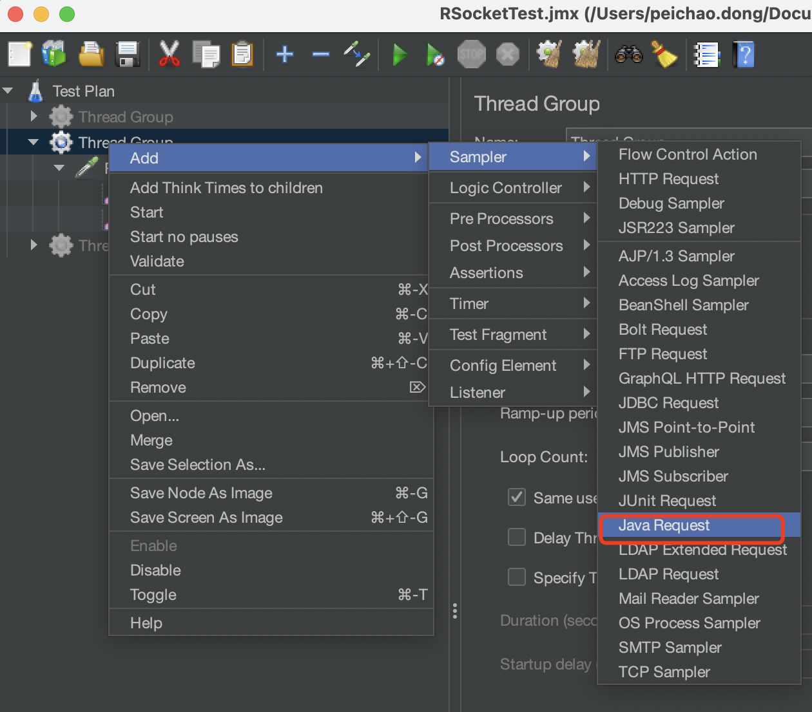
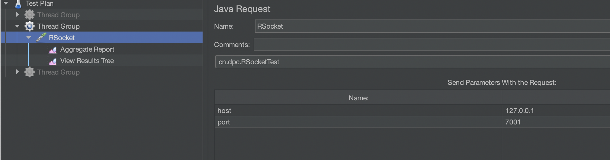
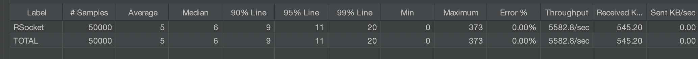
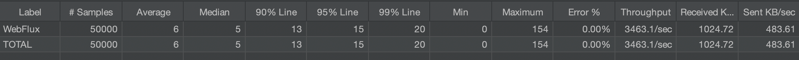
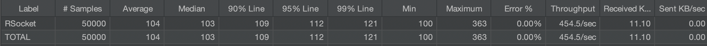
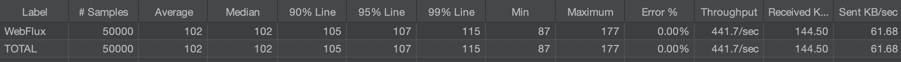
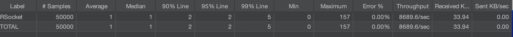
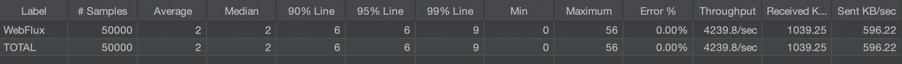

# 使用Jmeter Java Request进行RSocket接口性能测试

## 背景
> 上一篇博客[《通过自定义注解实现REST风格的RSocket CRUD应用》](1.md)介绍了在Spring如何开发RSocket应用，由于RSocket是不同于Http的新的通信协议，目前常见的压测工具都没有提供现成性能测试支持。  
> Jmeter中提供了Java Request压测方式，可以对Java方法进行压测，我们可以在Java方法中实现RSocket Client端接口调用逻辑，从而实现对RSocket接口的压测。

## 引入依赖
通过Spring的RSocketRequester来作为RSocket客户端工具，因此需要引入Spring相关依赖，编写压测方法需要继承实现JavaSamplerClient接口或继承AbstractJavaSamplerClient类，因此旭要引入org.apache.jmeter:ApacheJMeter_java依赖，具体gradle依赖及打包配置如下：
```
plugins {
    id 'java'
}

def withoutBom = {
    exclude group: 'org.apache.jmeter', module: 'bom'
}

dependencies {
    testImplementation 'org.junit.jupiter:junit-jupiter-api:5.8.1'
    testRuntimeOnly 'org.junit.jupiter:junit-jupiter-engine:5.8.1'
    implementation ('io.rsocket:rsocket-core:1.1.3')
    implementation'org.springframework:spring-messaging:5.3.23'
    implementation'org.springframework:spring-web:5.3.23'
    implementation 'com.fasterxml.jackson.dataformat:jackson-dataformat-cbor:2.14.0'
    implementation 'io.rsocket:rsocket-transport-netty:1.1.3'
    compileOnly 'org.apache.jmeter:ApacheJMeter_java:5.5', withoutBom
    testImplementation 'org.apache.jmeter:ApacheJMeter_java:5.5', withoutBom
}

// 将依赖资源都打到一个jar包中
jar {
    enabled=true
    duplicatesStrategy = DuplicatesStrategy.EXCLUDE

    manifest {
        attributes "Main-Class": "xx.xx.Xxxx"
    }

    from {
        configurations.runtimeClasspath.collect { it.isDirectory() ? it : zipTree(it) }
    }
}
```

## 编写测试代码
创建RSocketTest类并继承AbStractJavaSamplerClient，重写setupTest初始化RSocketRequester对象， 重写runTest方法，通过创建的RSocketRequester对象请求RSocket接口，将接口返回结果和响应时间通过SampleResult进行记录。
```java
public class RSocketTest extends AbstractJavaSamplerClient {
    private static RSocketRequester rsocketRequester;
    
    @Override
    public void setupTest(JavaSamplerContext context) {
        super.setupTest(context);
        String host = context.getParameter("host");
        int port = context.getIntParameter("port");
        rsocketRequester = RSocketRequester.builder()
                .rsocketStrategies(RSocketStrategies.builder()
                        .encoders(encoders -> {
                            encoders.add(new Jackson2CborEncoder());
                            encoders.add(new Jackson2JsonEncoder());
                        })
                        .decoders(decoders -> {
                            decoders.add(new Jackson2JsonDecoder());
                            decoders.add(new Jackson2CborDecoder());
                        })
                        .build())
                .tcp(host, port);
    }

    @Override
    public Arguments getDefaultParameters() {
        Arguments arguments = new Arguments();
        arguments.addArgument("host", "127.0.0.1");
        arguments.addArgument("port", "7001");
        return arguments;
    }

    @Override
    public SampleResult runTest(JavaSamplerContext context) {
        SampleResult sr = new SampleResult();
        CountDownLatch countDownLatch = new CountDownLatch(1);
        try {
            sr.sampleStart();
            rsocketRequester.route("toUpperCase")
                    .metadata(metadataSpec -> metadataSpec.metadata("111", 
							MimeType.valueOf("message/x.client.id")))
                    .data(DefaultPayload.create("hello"))
                    .retrieveMono(String.class)
                    .doOnError(error -> {
                                sr.setSuccessful(false);
                                error.printStackTrace();
                            }
                    ).doOnSuccess(item -> {
                        sr.setResponseData(item, null);
                        sr.setSuccessful(true);
                    }).doOnTerminate(() -> countDownLatch.countDown())
                    .subscribe();
            countDownLatch.await();
        } catch (Exception e) {
            sr.setSuccessful(false);
            e.printStackTrace();
        } finally {
            sr.sampleEnd();
        }

        return sr;
    }
}

```

## 运行测试步骤
* 将测试工程打成jar包，放入JMETER_HOME\lib\ext目录
* 运行Jmeter
* 右键点击”Test Plan”添加一个Thread Group（线程组）
* 右键点击线程组，添加一个Java Request


* 点击该Java Request就能看到之前新建的测试类



* 设定参数，双击可修改
* 右键线程组，添加一个聚合报告
* Ctrl+R运行测试计划，在聚合报告查看结果

## 压测结果对比
通过上述压测方法，对RSocket API 和Spring WebFlux API 三个场景进行了压测对比，被测应用均运行在2C4G 单个Docker容器中

* Request/Response模式
  被测方法：
```java
Mono<Message> toUpperCase(String payload,
                          String clientId) {
    return Mono.just(payload.toUpperCase())
            .map(Message::new)
            .log("toUpperCase " + clientId);
}
```

RSocket结果：


WebFlux结果：


* Request/Stream模式
  被测方法：
```java
Flux<Character> splitString(String payload) {
    return Flux.interval(Duration.ofMillis(20))
            .map(index -> payload.charAt(index.intValue()))
            .take(payload.length())
            .doOnNext(System.out::println);
}
```

Rocket结果：

WebFlux结果：


* Fire-and-Forget模式
  被测方法：
```java
void log(String message) {
    log.info("receive log message: {}", message);
}
```
Rocket结果：


WebFlux结果：


从三总压测结果可以看出，RSocket相较于Http具有一定的性能优势。

## 总结
本文介绍了通过Jmeter中Java Request方式对RSocket接口进行压测的方法，并对RSocket和Spring WebFlux做了性能压测对比，相关代码见[GitHub - pc-dong/rsocket-demos](https://github.com/pc-dong/rsocket-demos)。